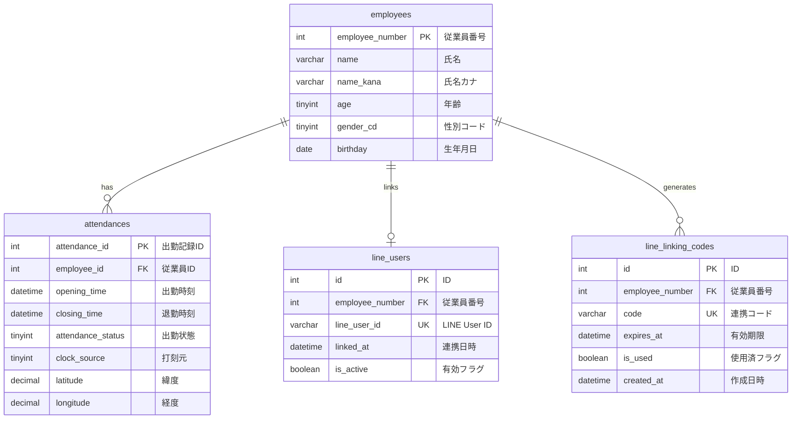

# 従業員用出勤管理システム 要件仕様書

## 1. システム概要

### 1.1 目的
従業員の出勤・退勤時刻を記録・管理し、勤怠状況を効率的に把握するためのWebベースの出勤管理システムを構築する。

### 1.2 対象ユーザー
- 従業員（出勤・退勤の記録を行う）
- 管理者（勤怠データの確認・管理を行う）

### 1.3 技術スタック
- **言語**: Go 1.25以上
- **Webフレームワーク**: gin
- **データベース**: MySQL 8.4.7
- **ORM**: GORM
- **ロギング**: Uber Zap
- **バリデーション**: go-playground/validator
- **環境変数管理**: envconfig
- **LINE連携**: LINE Messaging API SDK
- **開発環境**: Docker Compose

---

## 2. 機能要件

### 2.1 認証・認可機能

#### 2.1.1 ユーザー登録
- **機能概要**: 新規ユーザーアカウントを作成する
- **入力項目**:
  - メールアドレス（email）: 必須、メール形式
  - パスワード（password）: 必須、8文字以上、英数字記号を含む
  - 従業員番号（employee_number）: 必須
  - ロール（role）: 必須（admin / employee）
- **バリデーション**:
  - メールアドレスの重複チェック
  - パスワード強度チェック
  - 従業員番号の存在確認
- **処理内容**:
  - パスワードをハッシュ化して保存
  - アカウント情報をデータベースに登録
- **レスポンス**: 登録成功時に201 Createdとユーザー情報を返す

#### 2.1.2 ログイン
- **機能概要**: ユーザー認証を行いアクセストークンを発行する
- **入力項目**:
  - メールアドレス（email）: 必須
  - パスワード（password）: 必須
- **バリデーション**:
  - メールアドレスとパスワードの組み合わせ確認
- **処理内容**:
  - 認証情報の検証
  - JWTトークンの発行（アクセストークン、リフレッシュトークン）
  - ログイン履歴の記録
- **レスポンス**: 認証成功時にトークンとユーザー情報を返す

#### 2.1.3 ログアウト
- **機能概要**: ユーザーセッションを終了する
- **入力項目**: アクセストークン（Authorizationヘッダー）
- **処理内容**:
  - トークンの無効化（ブラックリストに追加）
  - ログアウト履歴の記録
- **レスポンス**: ログアウト成功時に200 OKを返す

#### 2.1.4 トークンリフレッシュ
- **機能概要**: 有効期限切れのアクセストークンを更新する
- **入力項目**: リフレッシュトークン
- **処理内容**:
  - リフレッシュトークンの検証
  - 新しいアクセストークンの発行
- **レスポンス**: 新しいアクセストークンを返す

#### 2.1.5 パスワード変更
- **機能概要**: ログイン中のユーザーのパスワードを変更する
- **入力項目**:
  - 現在のパスワード（current_password）: 必須
  - 新しいパスワード（new_password）: 必須、8文字以上
- **バリデーション**:
  - 現在のパスワードの確認
  - 新しいパスワードの強度チェック
- **処理内容**:
  - パスワードをハッシュ化して更新
- **レスポンス**: 更新成功時に200 OKを返す

#### 2.1.6 パスワードリセット
- **機能概要**: パスワードを忘れたユーザーのパスワードをリセットする
- **入力項目**: メールアドレス
- **処理内容**:
  - リセットトークンの生成
  - リセット用URLをメールで送信
  - トークンの有効期限設定（24時間）
- **レスポンス**: メール送信成功時に200 OKを返す

### 2.2 従業員管理機能

#### 2.2.1 従業員登録
- **機能概要**: 新規従業員情報を登録する
- **入力項目**:
  - 氏名（name）: 必須、最大255文字
  - 氏名カナ（name_kana）: 必須、最大255文字、カタカナのみ
  - 生年月日（birthday）: 必須、DATE形式
  - 性別（gender_cd）: 必須（1:男性、2:女性、3:その他）
  - メールアドレス（email）: 必須、メール形式
  - 電話番号（phone）: 任意、ハイフンなし数字のみ
  - 部署ID（department_id）: 必須
  - 役職ID（position_id）: 必須
  - 入社日（hire_date）: 必須、DATE形式
  - 雇用形態（employment_type）: 必須（1:正社員、2:契約社員、3:パート、4:アルバイト）
- **バリデーション**:
  - メールアドレスの重複チェック
  - 年齢計算（18歳以上）
  - カタカナ形式チェック
- **処理内容**:
  - 従業員番号を自動採番
  - 年齢を生年月日から自動計算
  - データベースに登録
- **レスポンス**: 登録成功時に201 Createdと従業員情報を返す

#### 2.2.2 従業員一覧取得
- **機能概要**: 従業員情報の一覧を取得する
- **入力項目**（クエリパラメータ）:
  - ページ番号（page）: デフォルト1
  - 1ページあたりの件数（limit）: デフォルト20、最大100
  - 部署ID（department_id）: 任意、フィルタ条件
  - 雇用形態（employment_type）: 任意、フィルタ条件
  - 検索キーワード（keyword）: 任意、氏名・氏名カナで部分一致検索
  - ソート項目（sort_by）: デフォルトemployee_number
  - ソート順（order）: デフォルトasc（asc / desc）
- **処理内容**:
  - 条件に合致する従業員情報を取得
  - ページネーション処理
- **レスポンス**: 従業員情報の配列と総件数を返す

#### 2.2.3 従業員詳細取得
- **機能概要**: 指定された従業員の詳細情報を取得する
- **入力項目**: 従業員番号（URLパラメータ）
- **処理内容**: 従業員情報と関連情報（部署、役職）を取得
- **レスポンス**: 従業員の詳細情報を返す

#### 2.2.4 従業員情報更新
- **機能概要**: 既存の従業員情報を更新する
- **入力項目**: 従業員登録と同様（従業員番号は変更不可）
- **バリデーション**:
  - 従業員の存在確認
  - メールアドレスの重複チェック（自分以外）
- **処理内容**: 指定された従業員情報を更新
- **レスポンス**: 更新成功時に200 OKと更新後の情報を返す

#### 2.2.5 従業員削除（論理削除）
- **機能概要**: 従業員を削除する（論理削除）
- **入力項目**: 従業員番号（URLパラメータ）
- **処理内容**:
  - 削除フラグを立てる
  - 削除日時を記録
  - 関連するアカウントも無効化
- **レスポンス**: 削除成功時に200 OKを返す

### 2.3 打刻機能

#### 2.3.1 出勤打刻
- **機能概要**: 従業員が出勤時刻を記録する
- **入力項目**:
  - 従業員番号（認証トークンから取得）
  - 打刻位置情報（latitude, longitude）: 任意
  - 打刻デバイス情報（device_info）: 任意
- **バリデーション**:
  - 当日の出勤打刻が既に存在しないことを確認
  - 位置情報が許可範囲内か確認（設定されている場合）
- **処理内容**:
  - 現在時刻を出勤時刻として記録
  - 定時との比較で遅刻判定を自動実施
  - 出勤状態を設定（1:通常出勤、3:遅刻）
- **レスポンス**: 打刻成功時に201 Createdと打刻情報を返す

#### 2.3.2 退勤打刻
- **機能概要**: 従業員が退勤時刻を記録する
- **入力項目**:
  - 従業員番号（認証トークンから取得）
  - 打刻位置情報（latitude, longitude）: 任意
  - 打刻デバイス情報（device_info）: 任意
- **バリデーション**:
  - 当日の出勤打刻が存在することを確認
  - 退勤打刻が未実施であることを確認
  - 位置情報が許可範囲内か確認（設定されている場合）
- **処理内容**:
  - 現在時刻を退勤時刻として記録
  - 定時との比較で早退判定を自動実施
  - 勤務時間・残業時間を自動計算
  - 出勤状態を更新（必要に応じて4:早退を設定）
- **レスポンス**: 打刻成功時に200 OKと打刻情報を返す

#### 2.3.3 打刻修正申請
- **機能概要**: 打刻忘れや打刻ミスの修正を申請する
- **入力項目**:
  - 対象日（target_date）: 必須
  - 修正種別（correction_type）: 必須（1:出勤時刻修正、2:退勤時刻修正、3:両方修正）
  - 修正後出勤時刻（corrected_opening_time）: 条件付き必須
  - 修正後退勤時刻（corrected_closing_time）: 条件付き必須
  - 修正理由（reason）: 必須、最大500文字
- **バリデーション**:
  - 対象日が過去日付であることを確認
  - 修正理由が入力されていることを確認
- **処理内容**:
  - 修正申請をデータベースに登録
  - 承認待ち状態で保存
  - 承認者に通知
- **レスポンス**: 申請成功時に201 Createdと申請情報を返す

#### 2.3.4 打刻履歴取得
- **機能概要**: 従業員の打刻履歴を取得する
- **入力項目**（クエリパラメータ）:
  - 従業員番号（employee_number）: 管理者のみ指定可能
  - 開始日（start_date）: 必須
  - 終了日（end_date）: 必須
- **処理内容**:
  - 指定期間の打刻履歴を取得
  - 一般従業員は自分の履歴のみ取得可能
  - 管理者は全従業員の履歴を取得可能
- **レスポンス**: 打刻履歴の配列を返す

### 2.4 勤怠記録管理機能

#### 2.4.1 勤怠記録一覧取得
- **機能概要**: 勤怠記録の一覧を取得する
- **入力項目**（クエリパラメータ）:
  - 従業員番号（employee_number）: 管理者のみ指定可能
  - 年月（year_month）: YYYY-MM形式、デフォルト当月
  - 出勤状態（attendance_status）: 任意、フィルタ条件
- **処理内容**:
  - 指定条件の勤怠記録を取得
  - 勤務時間・残業時間の集計
- **レスポンス**: 勤怠記録の配列と集計情報を返す

#### 2.4.2 勤怠記録詳細取得
- **機能概要**: 特定日の勤怠記録詳細を取得する
- **入力項目**:
  - 勤怠記録ID（URLパラメータ）
- **処理内容**: 勤怠記録の詳細情報を取得
- **レスポンス**: 勤怠記録の詳細情報を返す

#### 2.4.3 勤怠記録手動登録（管理者のみ）
- **機能概要**: 管理者が勤怠記録を手動で登録する
- **入力項目**:
  - 従業員番号（employee_number）: 必須
  - 対象日（target_date）: 必須
  - 出勤時刻（opening_time）: 必須
  - 退勤時刻（closing_time）: 必須
  - 出勤状態（attendance_status）: 必須
  - 備考（note）: 任意
- **バリデーション**:
  - 管理者権限の確認
  - 出勤時刻 < 退勤時刻の確認
  - 同一日の重複チェック
- **処理内容**:
  - 勤怠記録を登録
  - 勤務時間を自動計算
- **レスポンス**: 登録成功時に201 Createdを返す

#### 2.4.4 勤怠記録更新（管理者のみ）
- **機能概要**: 管理者が勤怠記録を更新する
- **入力項目**: 勤怠記録手動登録と同様
- **バリデーション**: 管理者権限の確認
- **処理内容**: 勤怠記録を更新し、勤務時間を再計算
- **レスポンス**: 更新成功時に200 OKを返す

#### 2.4.5 勤怠記録削除（管理者のみ）
- **機能概要**: 管理者が勤怠記録を削除する
- **入力項目**: 勤怠記録ID（URLパラメータ）
- **バリデーション**: 管理者権限の確認
- **処理内容**: 勤怠記録を削除
- **レスポンス**: 削除成功時に200 OKを返す

### 2.5 休暇管理機能

#### 2.5.1 休暇申請
- **機能概要**: 従業員が休暇を申請する
- **入力項目**:
  - 休暇種別（leave_type）: 必須（1:有給休暇、2:特別休暇、3:欠勤、4:半休）
  - 開始日（start_date）: 必須
  - 終了日（end_date）: 必須
  - 理由（reason）: 必須、最大500文字
  - 半休区分（half_day_type）: 条件付き必須（1:午前半休、2:午後半休）
- **バリデーション**:
  - 開始日 <= 終了日の確認
  - 有給休暇残日数の確認
  - 申請期間の重複チェック
- **処理内容**:
  - 休暇申請をデータベースに登録
  - 承認待ち状態で保存
  - 承認者に通知
- **レスポンス**: 申請成功時に201 Createdと申請情報を返す

#### 2.5.2 休暇申請一覧取得
- **機能概要**: 休暇申請の一覧を取得する
- **入力項目**（クエリパラメータ）:
  - 従業員番号（employee_number）: 管理者のみ指定可能
  - 承認状態（approval_status）: 任意（1:承認待ち、2:承認済み、3:却下）
  - 年月（year_month）: 任意
- **処理内容**:
  - 指定条件の休暇申請を取得
  - 一般従業員は自分の申請のみ取得可能
- **レスポンス**: 休暇申請の配列を返す

#### 2.5.3 休暇申請承認（管理者のみ）
- **機能概要**: 管理者が休暇申請を承認する
- **入力項目**:
  - 申請ID（URLパラメータ）
  - 承認コメント（comment）: 任意
- **バリデーション**:
  - 管理者権限の確認
  - 申請が承認待ち状態であることを確認
- **処理内容**:
  - 申請を承認済みに更新
  - 有給休暇の場合は残日数を減算
  - 申請者に通知
- **レスポンス**: 承認成功時に200 OKを返す

#### 2.5.4 休暇申請却下（管理者のみ）
- **機能概要**: 管理者が休暇申請を却下する
- **入力項目**:
  - 申請ID（URLパラメータ）
  - 却下理由（reject_reason）: 必須
- **バリデーション**:
  - 管理者権限の確認
  - 申請が承認待ち状態であることを確認
- **処理内容**:
  - 申請を却下状態に更新
  - 申請者に通知
- **レスポンス**: 却下成功時に200 OKを返す

#### 2.5.5 有給休暇残日数取得
- **機能概要**: 従業員の有給休暇残日数を取得する
- **入力項目**: 従業員番号（認証トークンから取得、管理者は指定可能）
- **処理内容**:
  - 付与日数と使用日数から残日数を計算
  - 有効期限切れの休暇を除外
- **レスポンス**: 残日数情報を返す

### 2.6 レポート・集計機能

#### 2.6.1 月次勤怠レポート取得
- **機能概要**: 月次の勤怠集計レポートを取得する
- **入力項目**（クエリパラメータ）:
  - 従業員番号（employee_number）: 管理者のみ指定可能
  - 年月（year_month）: 必須、YYYY-MM形式
- **処理内容**:
  - 指定月の勤怠データを集計
  - 出勤日数、欠勤日数、遅刻回数、早退回数を計算
  - 総勤務時間、残業時間を計算
- **レスポンス**: 月次集計レポートを返す

#### 2.6.2 部署別勤怠サマリー取得（管理者のみ）
- **機能概要**: 部署別の勤怠サマリーを取得する
- **入力項目**（クエリパラメータ）:
  - 部署ID（department_id）: 任意
  - 年月（year_month）: 必須
- **処理内容**:
  - 部署ごとの勤怠状況を集計
  - 平均勤務時間、平均残業時間を計算
- **レスポンス**: 部署別サマリーを返す

#### 2.6.3 勤怠データエクスポート（管理者のみ）
- **機能概要**: 勤怠データをCSV形式でエクスポートする
- **入力項目**（クエリパラメータ）:
  - 開始日（start_date）: 必須
  - 終了日（end_date）: 必須
  - 部署ID（department_id）: 任意
  - フォーマット（format）: デフォルトcsv（csv / excel）
- **処理内容**:
  - 指定期間の勤怠データを取得
  - CSV/Excel形式に変換
- **レスポンス**: ファイルをダウンロード

#### 2.6.4 異常勤怠アラート一覧取得（管理者のみ）
- **機能概要**: 異常な勤怠パターンを検出して一覧表示する
- **入力項目**（クエリパラメータ）:
  - 年月（year_month）: デフォルト当月
  - アラート種別（alert_type）: 任意
- **処理内容**:
  - 以下のパターンを検出
    - 連続欠勤
    - 過度な残業（月80時間以上）
    - 打刻忘れ
    - 深夜勤務
- **レスポンス**: アラート一覧を返す

### 2.7 通知機能

#### 2.7.1 打刻忘れ通知
- **機能概要**: 打刻を忘れた従業員に通知を送信する
- **トリガー**: 定時（例：10:00、18:00）にバッチ処理で実行
- **処理内容**:
  - 当日の打刻がない従業員を抽出
  - メール/アプリ内通知を送信
- **通知内容**: 打刻忘れの注意喚起

#### 2.7.2 承認待ち通知
- **機能概要**: 承認待ちの申請がある管理者に通知を送信する
- **トリガー**: 申請が作成された時点
- **処理内容**:
  - 承認権限を持つ管理者に通知
- **通知内容**: 申請内容のサマリー

#### 2.7.3 承認結果通知
- **機能概要**: 申請の承認/却下結果を申請者に通知する
- **トリガー**: 承認/却下処理が実行された時点
- **処理内容**:
  - 申請者にメール/アプリ内通知を送信
- **通知内容**: 承認/却下結果と理由

#### 2.7.4 残業アラート通知
- **機能概要**: 残業時間が基準を超えた従業員と管理者に通知する
- **トリガー**: 日次バッチ処理で実行
- **処理内容**:
  - 月間残業時間が基準（例：45時間）を超えた従業員を抽出
  - 本人と管理者に通知
- **通知内容**: 残業時間の警告

### 2.8 マスタ管理機能（管理者のみ）

#### 2.8.1 部署管理
- **機能概要**: 部署情報のCRUD操作
- **管理項目**:
  - 部署コード、部署名、親部署ID、責任者従業員番号

#### 2.8.2 役職管理
- **機能概要**: 役職情報のCRUD操作
- **管理項目**:
  - 役職コード、役職名、役職レベル

#### 2.8.3 勤務パターン管理
- **機能概要**: 勤務パターン（シフト）のCRUD操作
- **管理項目**:
  - パターン名、開始時刻、終了時刻、休憩時間、適用曜日

#### 2.8.4 祝日マスタ管理
- **機能概要**: 祝日情報のCRUD操作
- **管理項目**:
  - 日付、祝日名

#### 2.8.5 システム設定管理
- **機能概要**: システム全体の設定を管理
- **管理項目**:
  - 打刻許可位置情報（緯度経度、許容範囲）
  - 残業アラート基準時間
  - 有給休暇付与ルール
  - 通知設定（メール送信ON/OFF）
  - LINE Bot設定（Channel Access Token、Channel Secret）

### 2.9 LINE連携機能

#### 2.9.1 LINE アカウント連携

##### 2.9.1.1 連携開始
- **機能概要**: 従業員のLINEアカウントと従業員番号を紐付ける
- **処理フロー**:
  1. 従業員がLINE公式アカウントを友だち追加
  2. Botが連携コードの入力を促す
  3. 管理画面またはWebアプリで連携コードを発行
  4. 従業員がLINEで連携コードを送信
  5. システムがLINE User IDと従業員番号を紐付け
- **入力項目**:
  - 連携コード（8桁の英数字）
- **バリデーション**:
  - 連携コードの有効性確認（発行から24時間以内）
  - 連携コードが未使用であることを確認
  - 既に別のLINEアカウントと連携されていないことを確認
- **処理内容**:
  - LINE User IDと従業員番号をデータベースに保存
  - 連携完了通知を送信
- **レスポンス**: 連携成功メッセージをLINEで返信

##### 2.9.1.2 連携解除
- **機能概要**: LINEアカウントとの連携を解除する
- **実行方法**:
  - LINEで「連携解除」コマンドを送信
  - Webアプリの設定画面から解除
- **処理内容**:
  - 連携情報を無効化（論理削除）
  - 解除完了通知を送信

##### 2.9.1.3 連携状態確認
- **機能概要**: 現在の連携状態を確認する
- **実行方法**: LINEで「連携状態」コマンドを送信
- **レスポンス**: 従業員番号、氏名、連携日時を表示

#### 2.9.2 LINE打刻機能

##### 2.9.2.1 出勤打刻（LINE）
- **機能概要**: LINEから出勤時刻を記録する
- **実行方法**:
  - **方法1**: テキストメッセージ「出勤」を送信
  - **方法2**: クイックリプライボタン「出勤」をタップ
  - **方法3**: リッチメニューから「出勤打刻」をタップ
- **処理フロー**:
  1. 従業員が「出勤」を送信
  2. Botが位置情報の送信を要求（設定で有効な場合）
  3. 従業員が位置情報を送信
  4. システムが位置情報を検証
  5. 出勤時刻を記録
  6. 確認メッセージを送信
- **入力項目**:
  - コマンド: 「出勤」
  - 位置情報（任意、設定による）
- **バリデーション**:
  - LINE連携が有効であることを確認
  - 当日の出勤打刻が未実施であることを確認
  - 位置情報が許可範囲内であることを確認（設定による）
- **処理内容**:
  - 現在時刻を出勤時刻として記録
  - 遅刻判定を実施
  - 打刻元を「LINE」として記録
  - 位置情報を記録（送信された場合）
- **レスポンス**: 
  ```
  ✅ 出勤を記録しました
  
  📅 2025年11月25日（月）
  🕐 出勤時刻: 09:00
  📍 場所: オフィス
  ⏰ 状態: 通常出勤
  ```

##### 2.9.2.2 退勤打刻（LINE）
- **機能概要**: LINEから退勤時刻を記録する
- **実行方法**: 「退勤」コマンドまたはボタンをタップ
- **処理フロー**: 出勤打刻と同様
- **バリデーション**:
  - 当日の出勤打刻が存在することを確認
  - 退勤打刻が未実施であることを確認
- **処理内容**:
  - 現在時刻を退勤時刻として記録
  - 早退判定を実施
  - 勤務時間・残業時間を計算
- **レスポンス**:
  ```
  ✅ 退勤を記録しました
  
  📅 2025年11月25日（月）
  🕐 出勤時刻: 09:00
  🕕 退勤時刻: 18:00
  ⏱️ 勤務時間: 8時間00分
  📊 残業時間: 0時間00分
  ```

##### 2.9.2.3 打刻修正申請（LINE）
- **機能概要**: LINEから打刻修正を申請する
- **実行方法**: 「打刻修正」コマンドを送信
- **処理フロー**:
  1. 従業員が「打刻修正」を送信
  2. Botが対話形式で情報を収集
     - 対象日を選択（カレンダー表示）
     - 修正種別を選択（出勤/退勤/両方）
     - 修正後の時刻を入力
     - 修正理由を入力
  3. 確認画面を表示
  4. 申請を送信
- **レスポンス**: 申請受付完了メッセージと申請番号を表示

#### 2.9.3 LINE勤怠確認機能

##### 2.9.3.1 今日の勤務状況確認
- **機能概要**: 当日の勤務状況を確認する
- **実行方法**: 「今日の勤務」コマンドを送信
- **レスポンス**:
  ```
  📊 本日の勤務状況
  
  📅 2025年11月25日（月）
  🕐 出勤: 09:00
  🕕 退勤: 未打刻
  ⏱️ 現在の勤務時間: 6時間30分
  ```

##### 2.9.3.2 今週の勤務サマリー
- **機能概要**: 今週の勤務状況を確認する
- **実行方法**: 「今週の勤務」コマンドを送信
- **レスポンス**: Flex Messageで週間サマリーを表示
  - 各日の出勤/退勤時刻
  - 勤務時間の合計
  - 残業時間の合計

##### 2.9.3.3 今月の勤怠サマリー
- **機能概要**: 今月の勤怠集計を確認する
- **実行方法**: 「今月の勤務」コマンドを送信
- **レスポンス**:
  ```
  📊 2025年11月の勤怠サマリー
  
  📅 出勤日数: 18日
  ⏱️ 総勤務時間: 144時間00分
  📈 残業時間: 12時間30分
  🏃 遅刻: 1回
  🚪 早退: 0回
  ```

#### 2.9.4 LINE休暇申請機能

##### 2.9.4.1 休暇申請（LINE）
- **機能概要**: LINEから休暇を申請する
- **実行方法**: 「休暇申請」コマンドを送信
- **処理フロー**:
  1. 従業員が「休暇申請」を送信
  2. Botが対話形式で情報を収集
     - 休暇種別を選択（有給/特別休暇/欠勤/半休）
     - 開始日を選択（カレンダー表示）
     - 終了日を選択
     - 半休の場合は午前/午後を選択
     - 理由を入力（テキスト）
  3. 確認画面を表示（Flex Message）
  4. 申請を送信
- **バリデーション**:
  - 有給休暇の場合は残日数を確認
  - 申請期間の重複チェック
- **レスポンス**: 申請受付完了メッセージと申請番号を表示

##### 2.9.4.2 休暇申請一覧確認
- **機能概要**: 自分の休暇申請一覧を確認する
- **実行方法**: 「休暇申請一覧」コマンドを送信
- **レスポンス**: Carousel形式で申請一覧を表示
  - 申請日
  - 休暇種別
  - 期間
  - 承認状態（承認待ち/承認済み/却下）

##### 2.9.4.3 有給残日数確認
- **機能概要**: 有給休暇の残日数を確認する
- **実行方法**: 「有給残日数」コマンドを送信
- **レスポンス**:
  ```
  🌴 有給休暇残日数
  
  📊 残日数: 12.5日
  📅 付与日数: 20日
  ✅ 使用日数: 7.5日
  ⏰ 有効期限: 2026年3月31日
  ```

#### 2.9.5 LINE承認機能（管理者のみ）

##### 2.9.5.1 承認待ち通知
- **機能概要**: 承認待ちの申請を管理者にプッシュ通知
- **トリガー**: 申請が作成された時点
- **通知内容**: Flex Messageで申請内容を表示
  - 申請者名
  - 申請種別（打刻修正/休暇申請）
  - 申請内容のサマリー
  - 承認/却下ボタン

##### 2.9.5.2 承認処理（LINE）
- **機能概要**: LINEから申請を承認する
- **実行方法**: 通知メッセージの「承認」ボタンをタップ
- **処理フロー**:
  1. 管理者が承認ボタンをタップ
  2. 確認ダイアログを表示
  3. 承認を実行
  4. 申請者に承認通知を送信
- **レスポンス**: 承認完了メッセージを表示

##### 2.9.5.3 却下処理（LINE）
- **機能概要**: LINEから申請を却下する
- **実行方法**: 通知メッセージの「却下」ボタンをタップ
- **処理フロー**:
  1. 管理者が却下ボタンをタップ
  2. 却下理由の入力を促す
  3. 却下理由を入力
  4. 却下を実行
  5. 申請者に却下通知を送信

##### 2.9.5.4 承認待ち一覧確認
- **機能概要**: 承認待ちの申請一覧を確認する
- **実行方法**: 「承認待ち一覧」コマンドを送信（管理者のみ）
- **レスポンス**: Carousel形式で承認待ち申請を表示

#### 2.9.6 LINEプッシュ通知機能

##### 2.9.6.1 打刻忘れ通知（LINE）
- **機能概要**: 打刻を忘れた従業員にLINEで通知
- **トリガー**: 定時（10:00、18:00）にバッチ処理で実行
- **通知内容**:
  ```
  ⚠️ 打刻忘れのお知らせ
  
  本日の出勤打刻がまだ記録されていません。
  
  [出勤打刻する]ボタン
  ```

##### 2.9.6.2 承認結果通知（LINE）
- **機能概要**: 申請の承認/却下結果をLINEで通知
- **トリガー**: 承認/却下処理が実行された時点
- **通知内容**:
  - 承認の場合: 承認された旨と申請内容
  - 却下の場合: 却下理由と再申請の案内

##### 2.9.6.3 残業アラート通知（LINE）
- **機能概要**: 残業時間が基準を超えた場合にLINEで通知
- **トリガー**: 日次バッチ処理で実行
- **通知内容**:
  ```
  ⚠️ 残業時間アラート
  
  今月の残業時間が45時間を超えました。
  
  📊 今月の残業時間: 47.5時間
  ⚠️ 基準時間: 45時間
  
  健康管理にご注意ください。
  ```

#### 2.9.7 LINEリッチメニュー

##### 2.9.7.1 従業員用リッチメニュー
- **表示内容**:
  - 出勤打刻
  - 退勤打刻
  - 今日の勤務
  - 今月の勤務
  - 休暇申請
  - 有給残日数

##### 2.9.7.2 管理者用リッチメニュー
- **表示内容**:
  - 承認待ち一覧
  - 部署別サマリー
  - 異常勤怠アラート
  - 設定

#### 2.9.8 LINE LIFF アプリ（将来拡張）

##### 2.9.8.1 LIFF勤怠カレンダー
- **機能概要**: LINE内でカレンダー形式で勤怠を表示
- **機能**:
  - 月間カレンダー表示
  - 各日の出勤/退勤時刻表示
  - タップで詳細表示

##### 2.9.8.2 LIFF休暇申請フォーム
- **機能概要**: LINE内でリッチなフォームで休暇申請
- **機能**:
  - カレンダーピッカー
  - ドロップダウン選択
  - リアルタイムバリデーション

---

## 3. 非機能要件

### 3.1 パフォーマンス
- APIレスポンスタイムは通常時1秒以内
- 同時アクセス数は100ユーザーまで対応

### 3.2 可用性
- システム稼働率99%以上を目標

### 3.3 セキュリティ
- **現状**: 認証・認可機能は未実装
- **今後の対応**:
  - JWT等を使用した認証機能の実装
  - ロールベースのアクセス制御（RBAC）
  - HTTPS通信の強制

### 3.4 保守性
- クリーンアーキテクチャに基づいた階層構造
- 各層の責務を明確に分離
- インターフェースを使用した疎結合な設計

### 3.5 拡張性
- 新機能追加時に既存コードへの影響を最小限に抑える設計
- リポジトリパターンによるデータアクセス層の抽象化

---

## 4. システムアーキテクチャ

[architecture.md](./architecture.md)を参照

---

## 5. データベース設計

### 5.1 ER図



### 5.2 テーブル定義

#### 5.2.1 employeesテーブル（従業員マスタ）

| カラム名 | データ型 | NULL | キー | 説明 |
|---------|---------|------|------|------|
| employee_number | INT UNSIGNED | NO | PK | 従業員番号（自動採番） |
| name | VARCHAR(255) | NO | - | 氏名 |
| name_kana | VARCHAR(255) | NO | - | 氏名（カナ） |
| age | TINYINT UNSIGNED | NO | - | 年齢 |
| gender_cd | TINYINT UNSIGNED | NO | - | 性別コード（1:男性、2:女性） |
| birthday | DATE | NO | - | 生年月日 |

**制約**:
- PRIMARY KEY: employee_number

#### 5.2.2 attendancesテーブル（出勤記録）

| カラム名 | データ型 | NULL | キー | 説明 |
|---------|---------|------|------|------|
| attendance_id | INT UNSIGNED | NO | PK | 出勤記録ID（自動採番） |
| employee_id | INT UNSIGNED | YES | FK | 従業員ID |
| opening_time | DATETIME | NO | - | 出勤時刻 |
| closing_time | DATETIME | NO | - | 退勤時刻 |
| attendance_status | TINYINT UNSIGNED | NO | - | 出勤状態（1:出勤、2:欠勤、3:遅刻、4:早退） |
| clock_source | TINYINT UNSIGNED | NO | - | 打刻元（1:Web、2:モバイルアプリ、3:LINE） |
| latitude | DECIMAL(10,8) | YES | - | 打刻位置（緯度） |
| longitude | DECIMAL(11,8) | YES | - | 打刻位置（経度） |

**制約**:
- PRIMARY KEY: attendance_id
- FOREIGN KEY: employee_id REFERENCES employees(employee_number) ON DELETE CASCADE

#### 5.2.3 line_usersテーブル（LINE連携ユーザー）

| カラム名 | データ型 | NULL | キー | 説明 |
|---------|---------|------|------|------|
| id | INT UNSIGNED | NO | PK | ID（自動採番） |
| employee_number | INT UNSIGNED | NO | FK | 従業員番号 |
| line_user_id | VARCHAR(255) | NO | UK | LINE User ID |
| linked_at | DATETIME | NO | - | 連携日時 |
| is_active | BOOLEAN | NO | - | 有効フラグ（デフォルト: TRUE） |
| created_at | DATETIME | NO | - | 作成日時 |
| updated_at | DATETIME | NO | - | 更新日時 |

**制約**:
- PRIMARY KEY: id
- UNIQUE KEY: line_user_id
- FOREIGN KEY: employee_number REFERENCES employees(employee_number) ON DELETE CASCADE

#### 5.2.4 line_linking_codesテーブル（LINE連携コード）

| カラム名 | データ型 | NULL | キー | 説明 |
|---------|---------|------|------|------|
| id | INT UNSIGNED | NO | PK | ID（自動採番） |
| employee_number | INT UNSIGNED | NO | FK | 従業員番号 |
| code | VARCHAR(8) | NO | UK | 連携コード（8桁英数字） |
| expires_at | DATETIME | NO | - | 有効期限（発行から24時間） |
| is_used | BOOLEAN | NO | - | 使用済フラグ（デフォルト: FALSE） |
| used_at | DATETIME | YES | - | 使用日時 |
| created_at | DATETIME | NO | - | 作成日時 |

**制約**:
- PRIMARY KEY: id
- UNIQUE KEY: code
- FOREIGN KEY: employee_number REFERENCES employees(employee_number) ON DELETE CASCADE
- INDEX: expires_at（期限切れコードの定期削除用）

---

## 6. API仕様

### 6.1 ベースURL
```
http://localhost:8080/v1
```

### 6.2 エンドポイント一覧

#### 6.2.1 出勤記録登録

**エンドポイント**: `POST /v1/attendance/register`

**リクエスト**:
```json
{
  "opening_time": "2030-04-01 10:00:00",
  "closing_time": "2030-04-01 20:00:00"
}
```

**レスポンス**:
- **成功時（201 Created）**:
```json
{
  "massage": "registered!"
}
```

- **エラー時（400 Bad Request）**:
```json
{
  "error": "OpeningTimeは必須項目です,ClosingTimeの日付形式が不正です"
}
```

#### 6.2.2 出勤記録一覧取得

**エンドポイント**: `GET /v1/attendance/list`

**リクエスト**: なし

**レスポンス**:
- **成功時（200 OK）**:
```json
[
  {
    "attendance_id": 1,
    "employee_id": 1,
    "opening_time": "2030-04-01 10:00:00",
    "closing_time": "2030-04-01 20:00:00",
    "attendance_status": 1
  },
  {
    "attendance_id": 2,
    "employee_id": 1,
    "opening_time": "2030-04-02 09:30:00",
    "closing_time": "2030-04-02 18:30:00",
    "attendance_status": 1
  }
]
```

#### 6.2.3 出勤記録更新

**エンドポイント**: `PUT /v1/attendance/{id}`

**パスパラメータ**:
- `id`: 出勤記録ID

**リクエスト**:
```json
{
  "opening_time": "2030-04-01 09:00:00",
  "closing_time": "2030-04-01 19:00:00"
}
```

**レスポンス**:
- **成功時（200 OK）**:
```json
{
  "massage": "updated!"
}
```

#### 6.2.4 出勤記録削除

**エンドポイント**: `DELETE /v1/attendance/{id}`

**パスパラメータ**:
- `id`: 出勤記録ID

**リクエスト**: なし

**レスポンス**:
- **成功時（200 OK）**:
```json
{
  "massage": "deleted!"
}
```

### 6.3 HTTPステータスコード

| ステータスコード | 説明 |
|----------------|------|
| 200 OK | リクエスト成功（取得・更新・削除） |
| 201 Created | リソース作成成功（登録） |
| 400 Bad Request | リクエストパラメータ不正 |
| 500 Internal Server Error | サーバー内部エラー |

---

## 7. エラーハンドリング

### 7.1 エラー種別

#### BadRequestError
- **発生条件**: バリデーションエラー、リクエストパース失敗
- **HTTPステータス**: 400
- **ログレベル**: Error

#### InternalServerError
- **発生条件**: データベースエラー、予期しないエラー
- **HTTPステータス**: 500
- **ログレベル**: Error

### 7.2 バリデーションルール

#### 日時形式チェック（date_format_check）
- **フォーマット**: `YYYY-MM-DD HH:MM:SS`
- **例**: `2030-04-01 10:00:00`
- **実装**: カスタムバリデーター `DateFormatCheck`

---

## 8. 環境設定

### 8.1 環境変数

`.env`ファイルで以下の環境変数を設定：

```bash
# データベース接続情報
DB_USER=root
DB_PASSWORD=admin
DB_HOST=db
DB_NAME=attendance_management
```

### 8.2 Docker構成

#### アプリケーションコンテナ
- **コンテナ名**: attendance_app
- **ポート**: 8080:8080
- **ベースイメージ**: Goビルド環境

#### データベースコンテナ
- **コンテナ名**: attendance_db
- **イメージ**: mysql:8.4.7
- **ポート**: 3306:3306
- **初期データ**: `build/database/sql/`配下のSQLファイルを自動実行

---

## 10. 既知の課題・改善点

### 10.1 セキュリティ
> [!WARNING]
> - 認証・認可機能が未実装のため、誰でもAPIにアクセス可能
> - SQLインジェクション対策は不十分（文字列連結でクエリ構築している箇所がある）
> - CORS設定が未実装

### 10.2 データ整合性
> [!CAUTION]
> - 従業員IDが固定値（1）でハードコーディングされている
> - 出勤時刻と退勤時刻の前後関係チェックが未実装
> - 同一日の重複登録チェックが未実装

### 10.3 コード品質
> [!IMPORTANT]
> - エラーハンドリングで一部returnが抜けている箇所がある
> - レスポンスメッセージのタイポ（"massage" → "message"）
> - トランザクション管理が未実装

### 10.4 テスト
- ユニットテストが未実装
- 統合テストが未実装
- E2Eテストが未実装

---

## 11. 開発・運用手順

### 11.1 開発環境セットアップ

```bash
# リポジトリクローン
git clone <repository-url>
cd attendance_management

# 環境変数ファイル作成
cp .env.origin .env

# Docker環境起動
docker-compose up -d

# アプリケーション起動確認
curl http://localhost:8080/v1/attendance/list
```

### 11.2 開発ワークフロー

1. **コード修正**
   - ホットリロード機能（Air）により自動再起動

2. **動作確認**
   - curlまたはPostman等でAPIテスト

3. **ログ確認**
   ```bash
   docker-compose logs -f app
   ```

### 11.3 データベース操作

```bash
# MySQLコンテナに接続
docker exec -it attendance_db mysql -uroot -padmin attendance_management

# テーブル確認
SHOW TABLES;

# データ確認
SELECT * FROM attendances;
```

---

## 12. 参考情報

### 12.1 使用ライブラリ

| ライブラリ | バージョン | 用途 |
|-----------|-----------|------|
| gin-gonic/gin | 最新 | HTTPルーティング・Webフレームワーク |
| gorm.io/gorm | 最新 | ORM |
| gorm.io/driver/mysql | 最新 | MySQLドライバ |
| go.uber.org/zap | 最新 | 構造化ロギング |
| go-playground/validator | v10 | バリデーション |
| golang-jwt/jwt | v5 | JWT認証 |
| golang.org/x/crypto | 最新 | パスワードハッシュ化 |
| line/line-bot-sdk-go | v8 | LINE Messaging API SDK |

### 12.2 コーディング規約

- Goの標準的な命名規則に従う
- インターフェースは`-er`サフィックスを使用
- エラーは明示的にハンドリング
- ログは構造化ロギング（Zap）を使用

---

## 付録A: データサンプル

### 従業員データ
```sql
INSERT INTO employees(name, name_kana, age, gender_cd, birthday)
VALUES('山田太郎', 'ヤマダタロウ', 18, 1, '2004-01-01');
```

### 出勤記録データ
```sql
INSERT INTO attendances(employee_id, opening_time, closing_time, attendance_status)
VALUES(1, '2030-04-01 10:00:00', '2030-04-01 20:00:00', 1);
```

---

## 付録B: 用語集

| 用語 | 説明 |
|-----|------|
| 出勤記録 | 従業員の出勤・退勤時刻を記録したデータ |
| 出勤状態 | 出勤、欠勤、遅刻、早退などの勤怠状態 |
| opening_time | 出勤時刻 |
| closing_time | 退勤時刻 |
| attendance_status | 出勤状態コード（1:出勤、2:欠勤、3:遅刻、4:早退） |

---

**文書バージョン**: 3.0  
**作成日**: 2025-11-25  
**最終更新日**: 2025-11-25  
**変更履歴**:
- v1.0: 初版作成（現状ベースの機能要件）
- v2.0: 機能要件を大幅拡充、技術スタック更新（Go 1.25、gin、MySQL 8.4.7）、mermaid図修正
- v3.0: LINE連携機能を追加（アカウント連携、打刻、休暇申請、承認、通知、リッチメニュー）、データベース設計更新
